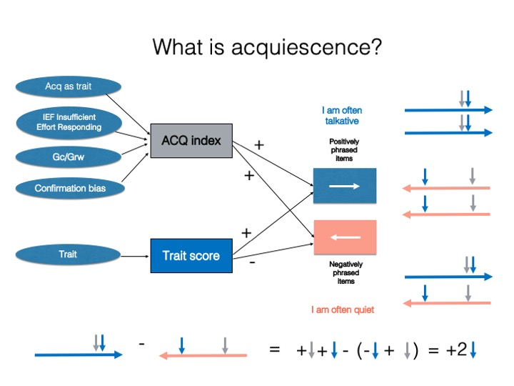
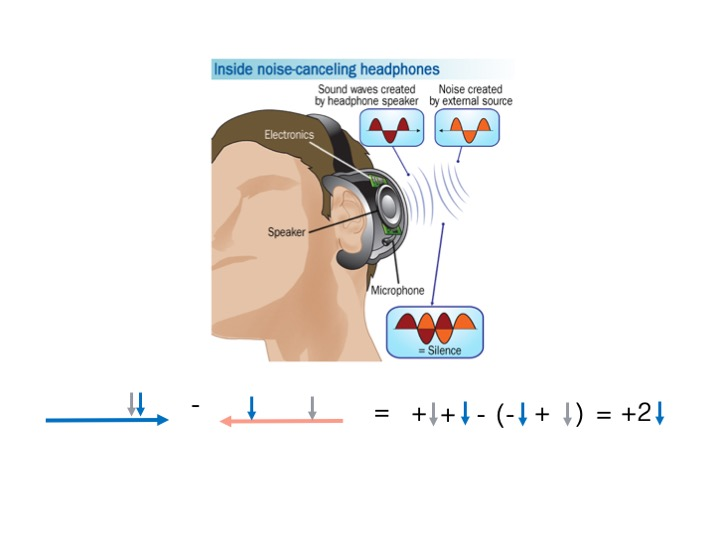

<!-- README.md is generated from README.Rmd. Please edit that file -->

```{r, include = FALSE}
knitr::opts_chunk$set(
  collapse = TRUE,
  comment = "#>",
  fig.path = "man/figures/README-",
  out.width = "100%"
)
```

# noisecanceling 

<!-- badges: start -->
[](https://lifecycle.r-lib.org/articles/stages.html#experimental)
[](https://github.com/rprimi/noisecanceling/actions/workflows/R-CMD-check.yaml)
[](https://www.gnu.org/licenses/gpl-3.0)
<!-- badges: end -->

`noisecanceling` measures and corrects **acquiescence response bias** — the
tendency to agree with questionnaire items regardless of their content — in
psychological scales built with **balanced items**.

## The noise-cancelling analogy

A good way to picture acquiescence correction is to think about how
noise-cancelling headphones work. The headphones use a microphone to "hear"
external noise and then play an inverted copy of that sound wave (180° out of
phase). The original noise and its inverted copy cancel out, and a clearer
signal emerges.

Balanced personality scales do something similar:

- the **trait** is the *signal*;
- **acquiescence** is the *noise*;
- the noise (acquiescence) appears as a *positive* push on **both**
  positively keyed (PK) and negatively keyed (NK) items.

When NK items are reverse-scored and items are summed into a scale score, the
trait signal is realigned to a common pole while the acquiescence noise ends up
split into equal positive and negative amounts that **cancel out**. If a scale
is carefully built with PK/NK items, what remains after centering
is a purified measure of the trait.

 
 


## Installation

You can install the development version from
[GitHub](https://github.com/rprimi/noisecanceling) with:

```r
# install.packages("remotes")
remotes::install_github("rprimi/noisecanceling")
```

## Example

`recode_for_acq()` estimates a per-person acquiescence index from the balanced
(paired) items and centers every response on it. `find_psychometrics()` then
compares the psychometrics of the original and the acquiescence-corrected
scores.

```{r example, message = FALSE, warning = FALSE}
library(noisecanceling)

data(data_senna)
data(senna_dic)

# 1. Estimate the acquiescence index and recode the responses.
recoded <- recode_for_acq(data_senna, senna_dic)
head(recoded$acq_index)

# 2. Classical psychometrics, original vs. acquiescence-corrected.
psicom <- find_psychometrics(recoded, likert = 5, center = 3)
psicom$alpha_orig_scale_stat[, c("scale", "raw_alpha")]
```

The package also provides `score_tests()` for scoring scales directly,
`item_histograms()` and `describe_likert()` for inspecting item distributions,
and `save_item_psicom()` / `save_loadings()` for exporting results to Excel.

## References

Primi, R., Santos, D., De Fruyt, F., & John, O. P. (2019). Comparison of
classical and modern methods for measuring and correcting for acquiescence.
*British Journal of Mathematical and Statistical Psychology*.
<https://doi.org/10.1111/bmsp.12168>
(pre-print: Primi et al., 2018, OSF, <https://doi.org/10.31219/osf.io/zsrwt>)

Primi, R., De Fruyt, F., Santos, D., Antonoplis, S., & John, O. P. (2020). True
or false? Keying direction and acquiescence influence the validity of
socio-emotional skills items in predicting high school achievement.
*International Journal of Testing, 20*(2), 97–121.
<https://doi.org/10.1080/15305058.2019.1673398>

Primi, R., Hauck-Filho, N., Valentini, F., Santos, D., & Falk, C. F. (2019).
Controlling acquiescence bias with multidimensional IRT modeling. In M. Wiberg,
S. Culpepper, R. Janssen, J. González, & D. Molenaar (Eds.), *Quantitative
psychology* (Springer Proceedings in Mathematics & Statistics, Vol. 265,
pp. 39–52). Springer. <https://doi.org/10.1007/978-3-030-01310-3_4>

Primi, R., Hauck-Filho, N., Valentini, F., & Santos, D. (2020). Classical
perspectives of controlling acquiescence with balanced scales. In M. Wiberg,
D. Molenaar, J. González, U. Böckenholt, & J.-S. Kim (Eds.), *Quantitative
psychology* (Springer Proceedings in Mathematics & Statistics, pp. 333–345).
Springer. <https://doi.org/10.1007/978-3-030-43469-4_25>

Primi, R., Hauck-Filho, N., & Valentini, F. (2023). Self-report and observer
ratings: Item types, measurement challenges, and techniques of scoring. In
J. Burrus, S. H. Rikoon, & M. W. Brenneman (Eds.), *Assessing competencies for
social and emotional learning: Conceptualization, development, and
applications* (pp. 99–116). Routledge.

Primi, R., & Santos, D. (2018). *Classical psychometric methods of acquiescence
control with balanced scales.*
<http://www.labape.com.br/acqu_mirt/methods_of_recoding.html>

Primi, R., & Santos, D. (2018). *Code for the simulations in "Comparison of
classical and modern methods…"*
<http://www.labape.com.br/acqu_mirt/simulation.html>

## License

GPL-3 © Ricardo Primi
